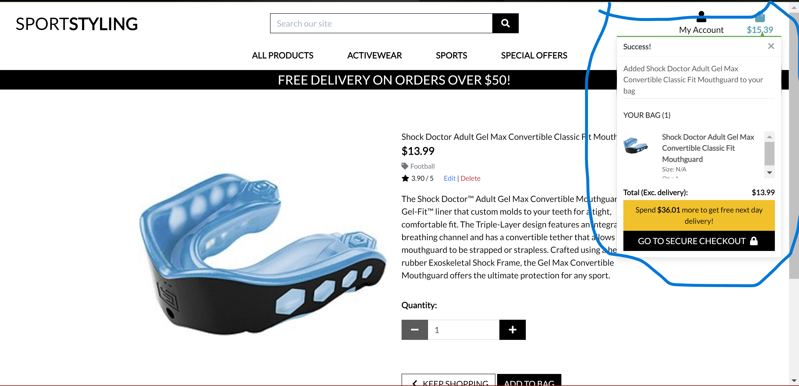
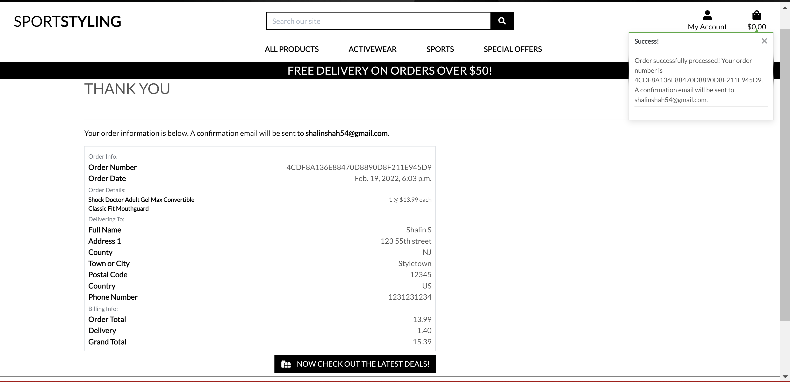
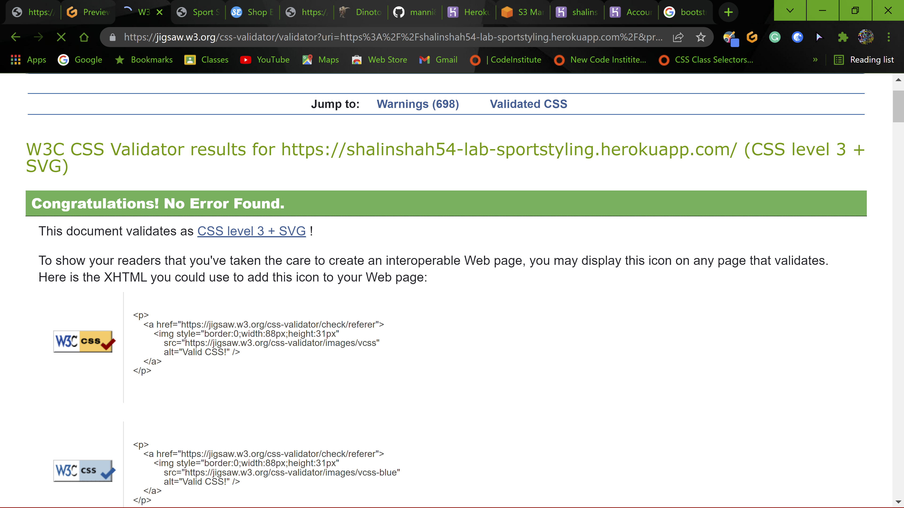

# SportStyling

## Aim/ Purpose

The Sport Styling is an E-commerce website for sports relating shopping where anybody can purchase any sports related items. The website allows users to shop through the different products, there details, rating  and price. They can just add the product they like and can added to the bag and purchase the item/items by safely checking out. This website is my Milestone Project 4 for the Full Stack Developer course at Code Institute. You can access this site by clicking [Sport Styling](https://shalinshah54-lab-sportstyling.herokuapp.com/)

## Table of Contents

- [User Experiencess](#user-experiences)
  - [User Stories](#user-stories)
  - [UX Framework](#ux-framework)
  - [Wireframes](#wireframes)
- [Existing Features](#existing-features)
- [Features to be added in future](#features-to-be-added-in-future)
- [Issues and Resolutions](#issues-and-resolutions)
- [Technoligies Used](#technologies-used)
  - [Languages used](#languages-used)
  - [Frameworks, Libraries, Programme and Resources Used](#frameworks-libraries-programme-and-resources-used)
- [Code Validation](#code-validation)
- [Testing](#testing)
- [Deployment](#deployment)
- [Credit](#credit)
- [Media](#media)
- [Acknowledgements](#acknowledgements)


## User Experiences

The goal of this shopping site is to provide a satisfactory user experience and an accessible platform for users to find various available shopping items which is sports related. The website should allow users to easily register or login and search through the site for the best sports related products online. After finding the product you need to simply add the product to the chart and once finished shopping just checkout. The users are also able to easily add and edit their shopping card and delete the product anytime. Once the order is placed the confirmation is emailed to the user and allows them to see there ordered items.

### User Stories

#### First Time User Goals
- As a first time user, I would like to just see around the online shop for the right products before signining up.
- As a first time user, I would like to read description on the product I would like to buy.
- As a first time user, I would like to add products to my shopping bag. 
- As a first time user, I would like to see products in the bag before checking out so I can edit or remove the unwanted products from the cart.
- As a first time user, I would like to safely and securely enter my information to make the purchase.
- As a first time user, I would like to recieve a confirmation via email with the order number and details.
- As a first time user, as I have filled out the informaiton during checkout would like to use that to signup and register to the site. 

#### Frequent User Goals
- As a frequent user, I would love to see new products on the site with good deals, and sales.
- As a frequent user, I want to login to my existing account I would like to track my old order history.
- As a frequent user, I want to be able to recieve newsletters with deals and coupons online via email.
- As a frequent user, I would like to safely logout keep my information secured.

#### Return User Goals
- As a return user, I want to easily navigate accross all the products and shop without any problems.
- As a return user, I want to see more products with new and upcoming fashions.
- As a return user, I would like to recieve emails with coupons so I can return back for more shopping.
- As a return user, I want to be save my items in the cart so when I log back in I can see my added items in the cart.

## UX Framework

### Strategy

The Sport Styling is an online e-com site with products to shop from by using front-end and back-end functionality, created using HTML, JavaScript, CSS, Python and Django. The goal is to create a website that is user-friendly and allows users to easily search and buy so many products.

### Scope

The website is interactive and allows users to shop around see the products they like and easily add them to the cart. Once added to the cart if the shopper need to edit or delete the item from the cart they can easily do so.
Otherwise they can checkout and see there order confirmation. 

#### Functional Requirements

Functional requirements include: a user-friendly navigation menu, a search bar, properly display of products onclicking shop now button, working templates for registration, login. The product can be added to the card by choosing which product if it requires size then you can select that, you can select as much quantity you need. There is a add to cart buttton that can send your item to the shopping cart. On clicking on the cart buttton you can easily review your order make changes if needed otherwise safely click on checkout. Here you are redirected to the form page where the user has fill the information and the credit card info. And can place your order and see the confirmation on the next page with all your information added in the checkout form. 

#### Content Requirements

The content of the site should include a header and image, as well as a dropdown navigation menu. A search bar should allow users to search for prducts. There is my account link which allows to register and login. There is profile link which shows your history purchases. There is cart which redirects you to the checkout page. There is a checkout form where the user has to fill out and on checkout and order confirmation is given via email and the user can see it in the profile also. User can search the products by categories, by price, by alphabetical order or by Deals. The products are sorted accordingly. There is product management for the admin user where they can mannually enter the product to the site and remove the product if needed. They can change the price if there is a deal update images. 

### Structures

In this e-com site the main structure is to let the users come and shop for there sporting needs. They browse through the site and see all the different products and select them simply add them to the cart and checkout. Just add all the required info and checkout. The user can log back in and check there past history in the profile section. The super user is the only one who can add, edit and delete a product change its description and update the price.


### Skeleton

The skeleton of the website will utilise Bootstrap for the CSS layout of the pages, font awesome and google fonts are used. A dropdown navigation menu will allow users to go to their choose there category of items like to search for. The main landing page will function to allow users to select numerous products by click on shop now, and seeing the products and added them to your cart. Used the authall forms for registration and login. Stripe is used for the credit card varification and added the payment type. Webhook Handler are used if the user accidently closes the tab in the ordering process it still takes care of the order without any issues. Heroku is used for deployment and ASW for storing the static part of the site along with media. Crispy forms are used in the product management for adding, editing and updating data.

### Surface

The surface design of the website will also utilise bootstrap CSS to provide styling for the components of the website.
The first step for my research was visiting sites and knowing different layouts, elements in navigation bar, images, products there details and pricing which are stored in the product.json. Media folder holds all the needed images for the site.

### _Colors_ :

- Black
- White
- Grey
- Green
- Alert colors have been added like red, green, yellow and blue

### _Typography_ :

- Lato

 Google Fonts is used to style the text using the 'Lato' font used throughtout the site.

 ## Wireframes

- As an initial process of the project design, wireframes were created for desktop and mobile screen sizes using [Figma Wireframe](https://www.figma.com/file/n6mZuV9SiD2jDU99MBnSrx/sportstyling?node-id=0%3A1).

## Existing Features
- All the pages on this website are mainly divided into 4 section which are:
  - Navbar
  - Flash Message
  - Main content
  - Checkout
  - Order Confirmation
  - Profile
  - Footer

#### Navbar
- Navbar consist of company name which is a link to the home page.
- Navbar also has a search bar which can find the products your looking for.
- There is a my account which is drop down for a new user it has registration and login.
- Once you login the my account drop down changes to the profile and logout.
- There is a shopping bag which adds items into it once you select any product and on clicking on it will take you to the checkout page.
- Then there are links All Products, Activewear, Sports and Special Offers. All are a drop down where you can selet the categories and go to the selected products.

#### Flash message
- There are flashing message which appears under the shopping cart if the task was successfull, and error occured.
- All the messages are color coded so it gives a visual feedback.

#### Main content
- On the home page there is small message which has a link shop now, on clicking onto it will redirect you to the all product page and all the items will appear.
- All the items contains add to cart option select size if necessary, quantity. 
- All the items have a brief description on it which is obtained by clicking on the product image.
- Once you add the item to the cart you'll get a message that the item has been added to the cart and cart will display item and the subtotal.
- There is registration form and login form once you signup.
- On the checkout there is a brief form which requires the user to add the information and safely checkout.
- Once the user checks out the message and the order confirmation appears which shows all the details of the purchased items.
- The user can login and under the profile can review there history of purchases.
- For the product management there is a form where the admin can make changes to the product add product and delete the product.

#### Footer
- Small footer is created to hold the copyright information of the website which is final section of the page and sit at the bottom and each page of the website contain same footer with same copyright information.

#### Home Page
- For the first time user landing on the home page will appear like. 
- On clicking on the shop now button it will redirect the user to the product page.

#### Product Page
- After directed to the products page the user will come accross all the products and will be able to scroll down and view everything. 
- On clicking on the image the description page will appear and that contains the image, description and the quantity and size of the product and just clicking on the add to bad or you can keep shopping.

#### Checkout
- The checkout page consist of checkout and there is item in the bag and can be edited removed or updated. 
- On clicking on the checkout the checkout page will appear and the form will be there to fill out and after entering the card and checking out will give a order confirmation.

#### Confirmation
- On the confirmation page the user will see all the information that they entered 
- There is going to be an confirmation email which was entered during checkout.


#### Regisration and Login page
- A new user can register and enter there email, username and password and signup.
- A login page appear and the user can login and check there profile.
- The profile contains the past order history.
- In the profile the user can change and edit there information.

### Product Management page
- The product Management is the page only accesses able for the super user/admin. 
- Here the admin can add the product mannually. Once added the admin can delete it change the prices on it and the update the description.

#### Edit/delete
- The admin can edit and delete the item from the shop, by editing the admin will be redirected to the products management form where they can edit and update it.
- If the product doesn't exist the admin can delete it and remove it from the database since its connected.
   

### Logout
- By logging out the person is still able to browse the accross the site.


## Issues and Debugging

- 


# Technologies Used

## Languages Used

-   [HTML5](https://en.wikipedia.org/wiki/HTML5)
-   [CSS3](https://en.wikipedia.org/wiki/Cascading_Style_Sheets)
-   [Jquery](https://en.wikipedia.org/wiki/Jquery)
-   [Python3](https://en.wikipedia.org/wiki/Python_Programming_Language)

## Frameworks, Libraries & Programs Used

1. [Bootstrap 5.x:](https://getbootstrap.com/)
    - Bootstrap 5.x was used to assist with the responsiveness and styling of the website.
2. [Font Awesome 5:](https://fontawesome.com/)
    - Font Awesome was used on all pages throughout the website to add icons for aesthetic and UX purposes.
3. [jQuery:](https://jquery.com/)
    - jQuery came with bootstrap to make the navbar entire site responsive.
4. [Git](https://git-scm.com/)
    - Git was used for version control by utilizing the Gitpod terminal to commit to Git and Push to GitHub.
5. [GitHub:](https://github.com/)
    - GitHub is used to store the projects code after being pushed from Git. 
6. [Figma:](https://figma.com/)
    - Figma was used to create the [Figma Wireframe](https://www.figma.com/file/n6mZuV9SiD2jDU99MBnSrx/sportstyling?node-id=0%3A1).
7. [Heroku:](https://heroku.com/)
    - Heroku was used to create  and deploy our app.    
8. [Django:](https://django.com/)
    - Django was used to create the framework.
9. [Postgresql:](https://postgresql.org/)
    - Mongodb was used to create database and to connect server to our site.
10. [Stripe:](https://stripe.com/)
    - Stripe was used to accept and authorise payment for any item purchased on the site.
11. [AWS:](https://s3.console.aws.amazon.com/)
    - Amazon S3 was used to manage and save media and collectstatic file in Its cloud service.
12. - [HTML Formatter](https://htmlformatter.com/) 
    - HTML formatter was used to format HTML code
13. - [W3.CSS](https://www.w3schools.com/w3css/defaulT.asp) 
    - General resources.
14. - [Stack Overflow](https://pt.stackoverflow.com/)
15. - [Youtube](https://www.youtube.com/)     
16. - General resources.
17. - Code Institute SLACK Community

## Code Validation

- [W3C Markup Validation](https://validator.w3.org/#validate_by_input) 
  - 
  - W3C Markup Validation was used throughout the process to validate HTML codes
- [W3C CSS Validation](https://jigsaw.w3.org/css-validator/) 
  - 
  - W3C CSS Validation was used to vaildate CSS codes
- [Lighthouse](https://developers.google.com/web/tools/lighthouse) 
  -  


    
# Testing 
- Testing has an extented file attached [CLICK HERE TO VIEW](TEST.md)    


# Deployment Steps


## Contents

* [Basic Requirements](#basic-requirements)

* [Environment Variables](#environment-variables)
  * [GitPod IDE](#gitpod-ide)
  * [Non-GitPod IDE](#non-gitpod-ide)
  * [Key-value Pairs](#key-value-pairs)

* [Initial Deployment](#initial-deployment)

* [Amazon AWS](#amazon-aws)
  * [S3 Bucket](#s3-bucket)
  * [IAM](#iam)
  * [Final AWS Steps](#final-aws-steps)

* [How to Fork it](#how-to-fork-it)

* [Making a Local Clone](#making-a-local-clone)

* [Email Setup](#email-setup)
  * [Gmail](#gmail)
  * [Outlook](#outlook)

* [Google Signup](#google-signup)

---

## Basic Requirements

* An IDE, such as GitPod or VSCode
* Git, for version control
* GitHub account
* Python3
* pip, for Python package installation
* Heroku account
* AWS S3 account
* Stripe account
* Email account

[Back to the top](#deployment-steps)

---

## Environment Variables

### GitPod IDE

| Key                   | Value                            |
|-----------------------|----------------------------------|
| SECRET_KEY            | ## YOUR SECRET_KEY ##            |
| DATABASE_URL          | ## POSTGRES_URL
| STRIPE_PUBLIC_KEY     | ## YOUR STRIPE_PUBLIC_KEY ##     |
| STRIPE_SECRET_KEY     | ## YOUR STRIPE_SECRET_KEY ##     |
| STRIPE_WH_SECRET      | ## YOUR STRIPE_WH_SECRET ##      |
| EMAIL_HOST_USER       | ## YOUR EMAIL ADDRESS ##         |
| EMAIL_HOST_PASS       | ## YOUR EMAIL APP PASS CODE ##   |
| AWS_SECRET_ACCESS_KEY | ## YOUR AWS_SECRET_ACCESS_KEY ## |
| AWS_ACCESS_KEY_ID     | ## YOUR AWS_ACCESS_KEY_ID ##     |
| USE_AWS               | True                             |
------------------------------------------------------------


### Non-GitPod IDE

```python
import os

os.environ["SECRET_KEY"] = "## YOUR SECRET_KEY ##"
os.environ["DATABASE_URL"] = "## POSTGRES_URL ##"
os.environ["STRIPE_PUBLIC_KEY"] = "## YOUR STRIPE_PUBLIC_KEY ##"
os.environ["STRIPE_SECRET_KEY"] = "## YOUR STRIPE_SECRET_KEY ##"
os.environ["STRIPE_WH_SECRET"] = "## YOUR STRIPE_WH_SECRET ##"
os.environ["EMAIL_HOST_USER"] = "## YOUR EMAIL ADDRESS ##"
os.environ["EMAIL_HOST_PASS"] = "## YOUR EMAIL APP PASS CODE ##"
os.environ["AWS_SECRET_ACCESS_KEY"] = "## YOUR AWS_SECRET_ACCESS_KEY ##"
os.environ["AWS_ACCESS_KEY_ID"] = "## YOUR AWS_ACCESS_KEY_ID ##"
os.environ["USE_AWS"] = True
os.environ["DEVELOPMENT"] = True
```

### Key-value Pairs

To find the values of each key:

* SECRET_KEY: This is a custom string set up to keep sessions secure. I recommend using a 'Fork Knox' level password generated by [RandomKeygen](https://randomkeygen.com/).
* DATABASE_URL: This is used for the database[Postgres](https://www.heroku.com/postgres),
* STRIPE_PUBLIC_KEY: On the Stripe Dashboard in the Developer's API section - Publishable key.
* STRIPE_SECRET_KEY: On the Stripe Dashboard in the Developer's API section - Secret key.
* STRIPE_WH_SECRET: In the Developer's Webhooks section after creating an endpoint for your webhook - Signing secret.
* EMAIL_HOST_USER: Your email address or username. [See below for instructions](#email-setup).
* EMAIL_HOST_PASS: Your passcode from your email client. [See below for instructions](#email-setup).
* AWS_SECRET_ACCESS_KEY: From the CSV file that you download having created a User in Amazon AWS S3. [See below for instructions](#amazon-aws).
* AWS_ACCESS_KEY_ID: From the CSV file that you download having created a User in Amazon AWS S3. [See below for instructions](#amazon-aws).

[Back to the top](#deployment-steps)

---

## Initial Deployment

This site was deployed to Heroku by following these steps:

1. Heroku needs to be told what the requirements are for this project, so go into your GitPod terminal, and create files to explain the requirements by using the following commands:
    * `pip3 freeze --local > requirements.txt`
    * `echo web: python run.py > Procfile` - Ensure there is no blank line after the contents of this file.
2. Push these changes to your repository.
3. Login or sign up to [Heroku](https://www.heroku.com).
4. Select '**Create New App**' in the top right of your dashboard.
5. Choose a unique app name, and select the region closest to you, before clicking '**Create App**'.
6. Go to the '**Deploy**' tab, find '**Deployment Method**', and select '**GitHub**'.
7. Search to find your GitHub repository, and click '**Connect**'. Don't enable automatic deployment yet, as this can cause errors.
8. Go to the '**Settings**' tab, find '**Config Vars**', and click '**Reveal Config Vars**'.
9. Enter key-value pairs that match those in your project files, as shown above in [Environment Variables](#environment-variables).
10. In Heroku, go to the '**Resources**' tab, and add on '**Heroku Postgres**' with the free plan.
11. Make migrations to start using PostgreSQL by running `python3 manage.py makemigrations` then `python3 manage.py migrate`.
12. If it returns `django.db.utils.OperationalError: FATAL: role "xxxxxxxx" does not exist`, then run `unset PGHOSTADDR` in your terminal and run the commands in step 11 again.
13. Load the category and product fixtures by running `python3 manage.py loaddata categories`, then `python3 manage.py loaddata products`.
14. Create a superuser to access the Django admin panel by running `python3 manage.py createsuperuser` then following the instructions in the terminal.
15. Remove the DATABASE_URL from your environment variables or env.py file.
16. Install the Heroku CLI and log in using either `heroku login` or `heroku login -i`.
17. Run `heroku config:set DISABLE_COLLECTSTATIC=1 --app shalinshah54@gmail.com`.
18. Run `git add .`, `git commit -m "Your commit message here"`, `git push`.
19. Add the hostname of your Heroku app to '**ALLOWED HOSTS**' in your settings.py file. This can be found in Heroku Settings > App Name.
20. Connect Heroku to Git using `git remote add heroku {your heroku git url}`.
21. If you'd like to automatically deploy to Heroku whenever you push to GitHub, do the following:
    * Go to the '**Deploy**' tab in Heroku, and click '**Enable Automatic Deployment**'.
    * In '**Manual Deploy**', choose which branch you'd like to deploy from (I chose '**main**' branch, this is sometimes '**master**').
    * Click '**Deploy Branch**' to deploy your app onto the Heroku servers.
    * Once the app has finished building, click '**Open App**' to open your site.
22. If you don't want to automatically deploy to Heroku, do the following:
    * Enter `git push -u heroku main` or `git push -u heroku master`.
23. Your app will now be running at **<https://{your-app-name}.herokuapp.com/>**

[Back to the top](#deployment-steps)

---

## Amazon AWS

### S3 Bucket

1. Create a new bucket, give it a name, and choose the region closest to you.
2. Go to '**Properties**', turn on static website hosting, and fill in `index.html` and `error.html` where it suggests.
3. Go to '**Permissions**', and add the code block underneath this section into your CORS config to link Heroku and your S3 bucket.
4. Still in '**Permissions**', go to '**Bucket Policy**', '**Edit**', '**Policy Generator**'.
5. In '**Select Type of Policy**' choose '**S3 Bucket Policy**'.
6. In '**Add Statements**', select '**Effect**' of `Allow`, enter `*` into '**Principal**', in '**Actions**' choose `GetObject`, enter your ARN from your main S3 Bucket page, and click '**Add Statement**'.
7. Then click '**Generate**', and copy and paste your generated policy into the Bucket Policy area.
8. Add `/*` at the end of the '**Resource**' line, and save.
9. Still in '**Permissions**', go to the '**Access Control List**', and select `List` next to '**Everyone**'.

```python
  [
    {
      "AllowedHeaders": [
        "Authorization"
      ],
      "AllowedMethods": [
        "GET"
      ],
      "AllowedOrigins": [
        "*"
      ],
      "ExposeHeaders": []
    }
  ]
```

### IAM

1. Go to '**User Groups**', '**Create New Group**', enter a sensible name (I chose `manage-ms4-lead-shot-hazard`), and click '**Create**'.
2. Go to '**Policies**', '**Create New Policy**', '**JSON**', '**Import Managed Policy**', '**S3**', '**AmazonS3FullAccess**', '**Import**'.
3. Get your ARN from '**S3 Permissions**', delete the `*` from '**Resource**', and add the code block underneath this section into the area.
4. Click '**Next**', '**Review**', provide a name and description, and click '**Create Policy**'.
5. Go to '**User Groups**', '**Find New Group**', '**Permissions**', '**Add Permissions**', '**Attach Policies**', find the policy you created in steps 3 and 4, and click '**Add Permissions**'.
6. Go to '**Users**', provide a name, and tick the checkbox beside '**Access key - Programmatic access**'.
7. Click '**Next**', select the group you created in step 1, and click through to the end.
8. Finally, click '**Create User**', and download the CSV file, which will contain your `AWS_SECRET_ACCESS_KEY` and your `AWS_ACCESS_KEY_ID`. This is the only time that this CSV file will be available, so it's very important to download it at this stage.

```python
"Resource": [
    "{YOUR ARN}",
    "{YOUR ARN}/*"
]
```

### Final AWS Steps

1. Remove the `DISABLE_COLLECTSTATIC` variable from your environment variables.
2. When you next deploy to Heroku, AWS will retrieve your static files and store them.
3. Go to S3, you'll see that you have a '**static**' folder with all your static files in it.
4. Create a '**media**' file in your S3 Bucket, click '**Upload**'.
5. Click '**Add Files**', then select all your product images.
6. Under '**Manage Public Permissions**', select '**Grant Public Read Access**'.
7. Then click through until you can click '**Upload**'.
8. Finally, attempt to log in to the site using the superuser details, then access the '**admin**' panel on the live site, go to '**Email Addresses**', and select Primary and Verified on the superuser email address.

[Back to the top](#deployment-steps)

---

## How to Fork it

1. Login or Sign Up to [GitHub](www.github.com).
2. On GitHub, go to [shalinshah54-lab/sportstyling](https://github.com/shalinshah54-lab/sportstyling).
3. In the top right, click '**Fork**'.
4. Store your environment variables
    * GitPod
        * Go to GitPod Workspaces.
        * Click '**Settings**'.
        * Store your variables in the '**Variables**' section, as shown above in [Environment Variables](#environment-variables).
    * Another IDE
        * Create an `env.py` file in the root directory of the project.
        * Enter your variables, as shown above in [Environment Variables](#environment-variables).
5. You will also need to install all of the project requirements. This can be done using the command `pip3 install -r requirements.txt`.
6. Type `python3 manage.py runserver` in your GitPod terminal to run your local site of this project.

[Back to the top](#deployment-steps)

---

## Making a Local Clone

1. Clone from GitHub
    * Log in to [GitHub](https://www.github.com) and locate the [Repository](https://github.com/alexandergrib/ms4-store) for this site.
    * Under the repository name, above the list of files, click '**Code**'.
    * Here you can either Clone or Download the repository.
    * Open Git Bash.
    * Change the current working directory to the new location, where you want the cloned directory to be.
    * Type `git clone`, and then paste the URL that was copied in Step 4.
    * Press Enter, and your local clone will be created.
    * Run `git remote rm origin` in your terminal to remove the link to this repo.
2. Install Python's required packages
    * You will need to install all project requirements, using the command `pip3 install -r requirements.txt`.
3. Store environment variables
    * GitPod
        * Go to GitPod Workspaces.
        * Click '**Settings**'.
        * Store your variables in the '**Variables**' section, as shown above in [Environment Variables](#environment-variables).
    * Another IDE
        * Create an `env.py` file in the root directory of the project.
        * Enter your variables, as shown above in [Environment Variables](#environment-variables).
4. Migrate database models
    * Run `python3 manage.py makemigrations`.
    * Run `python3 manage.py migrate`.
5. Load data
    * These must be run in this order, as the products need the categories to populate correctly.
    * Run `python3 manage.py loaddata categories`.
    * Run `python3 manage.py loaddata products`.
6. Create a Superuser
    * A superuser is required to access the Django admin panel.
    * Run `python3 manage.py createsuperuser`.
    * Follow the instructions in the terminal.
7. Run the project locally
    * Type `python3 manage.py runserver` in your IDE terminal to run your local site of this project.

For a more detailed version of these steps, go to the [Github Docs](https://docs.github.com/en/github/creating-cloning-and-archiving-repositories/cloning-a-repository#cloning-a-repository-to-github-desktop) page on this topic.

[Back to the top](#deployment-steps)

---

## Email Setup

Before beginning these steps, go to `settings.py` and change the `DEFAULT_FROM_EMAIL` to your own email address.

### Gmail

1. Go to your Gmail, and enter the '**Settings**' tab.
2. Go to '**Accounts and Imports**', '**Other Google Account Settings**'.
3. Go to the '**Security**' tab, and scroll down to '**Signing in to Google**'.
4. Click on '**2-step Verification**', click '**Get Started**', and enter your Gmail password.
5. Verify using your preferred method, and then turn on 2-step verification.
6. Go back to '**Security**', '**Signing in to Google**', then go to '**App Passwords**'.
7. Enter your password again if prompted, then set '**App**' to `Mail`, '**Device**' to `Other`, and type in `Django`.
8. Copy and paste the passcode that shows up, this is your '**EMAIL_HOST_PASS**' variable.

### Outlook

* In `settings.py` change `EMAIL_HOST` to `smtp.office365.com`.
* For EMAIL_HOST_USER, please enter your Outlook username.
* For EMAIL_HOST_PASS, please enter your Outlook password.

[Back to the top](#deployment-steps)

---

## Google Signup


1. Go to [Google Console](https://console.cloud.google.com/), go to '**APIs**', then '**Credentials**' and set up credentials for your Google app.
2. You want to create a new '**OAuth 2.0 Client ID**'.
3. Give it a relevant name for your project.
4. Under '**Authorised JavaScript origins**', enter your localhost domain, and your live site domain, with no `/` at the end.
5. Under '**Authorised redirect URIs**', enter the same domains as above, and add `/accounts/google/login/callback/` to the end of them.
6. Click '**Save**'.
7. Go into this newly created '**Client ID**', and to the right, you'll see your **Client ID** number and your **Client Secret**.
8. Go to your site's **admin console**, login, click on '**Social Applications**', and click '**Add Social Application**'.
9. From the dropdown, select the provider of '**Google**'.
10. Give it a relevant name for your project, and add in your **Client ID** and **Client Secret** from step 7.
11. Highlight your chosen site from '**Available Sites**', move it into '**Chosen Sites**', and click '**Save**'.

[Back to the top](#deployment-steps)

## Credits
- I would like to thank CI mini project Tim Nelson the Tutor which excellently explained the project which made things very clear. 
- I would like to thank Alexander Grid a CODE INSTITUTE student for inspiring me work on this project.

## Media
- All the images are from [unsplash](https://unsplash.com/)
- All the images for products [dick's sporting good](www.dickssportinggoods.com)

## Acknowledgements
- I would like to thank my mentor Sandeep Agarval for his guidance and advice on this project before submission.
- Thanks to everyone on Slack Community for always being on-hand with requests and support.
- Thanks to everyone on CI tutor support team for always providing with the support and guidance.
- I would like to thank Alexander Grid from Code institute for inspiring me and giving me ideas for this site.
- Thanks to everyone from Student Care team (CI) for keeping me update with all changes such as tutor support availibility holiday period and most importantly checking regularly on my progress and always ready to support on my study.