## Testing 

### First Time User Goals

- As a first time user I would see a home page with navbar and an main-image. 
- 
- There is My Account Icon and Shopping bag on the right corner.
- There is a search bar which can search the categories and products. If the names products are not there then an empty result will appear.
- Under the search bar there are navlinks which are All Products, Activewear, Sports and Special offers.
- These links are drop down so if the user clicks on All Products
   * By price 
   * By Rating
   * By Category
   * Shop all Products
- Under the Activewear 
   * Apparels
   * Accessories
   * Footwear
   * All Activewear
- Under the Sports
   * Baseball
   * Basketball
   * Football
   * Soccer
- Under Special Offers
   * New Arrivals
   * Deals
   * clearance
   * All Special Offers
- By using these links you can navigate to any products of your interest.
- On the main-image there is a shop now button which will redirect to the products page.
- On this page under my account you can register as new user or log in as a returning user.
- For registration there is simple form and login there is text field to enter the info and signin.
- After seeing all the products simply click on the image and the description page will open.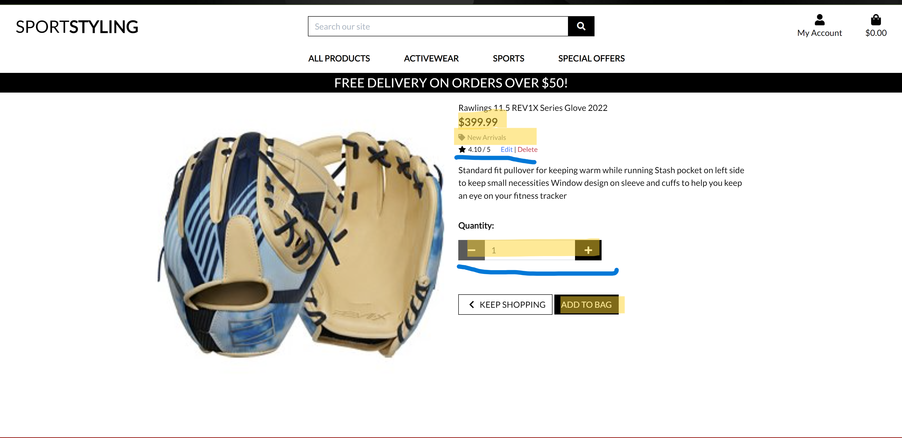
This contains a description of the product, size, quantity and the rating. Under that there is a price and two buttons.
- One is to add the item to cart and the other is to keep shopping.
- Once the item is in the cart a popup will appear under the shopping bag showing the item and the price of it.

- If you like to add more items then you can but if you want to check out then simply click on the bag and will take you to the checkout page.
- There you will see your product if you want to edit or change the
product with size or quantity can just click on update and if you want to remove the item then just remove it.
- Now Continue to secure checkout and the form will appear.
- Fill out the form and the required details and proced to checkout by completing the order.
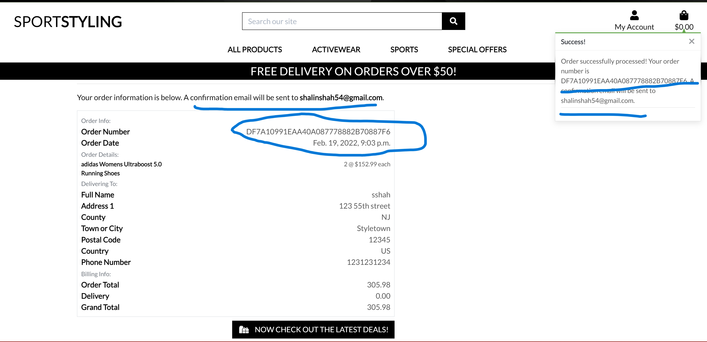
- Then a loading spinner will appear which shows that the payment is being processed.
- Then a Thank You Page appears with the statment that the order has been submitted and email has been send.
- Under that there is a detailed order history.
- The user can register using the registration form and login.
- Once logged in he can see his past history purchases. 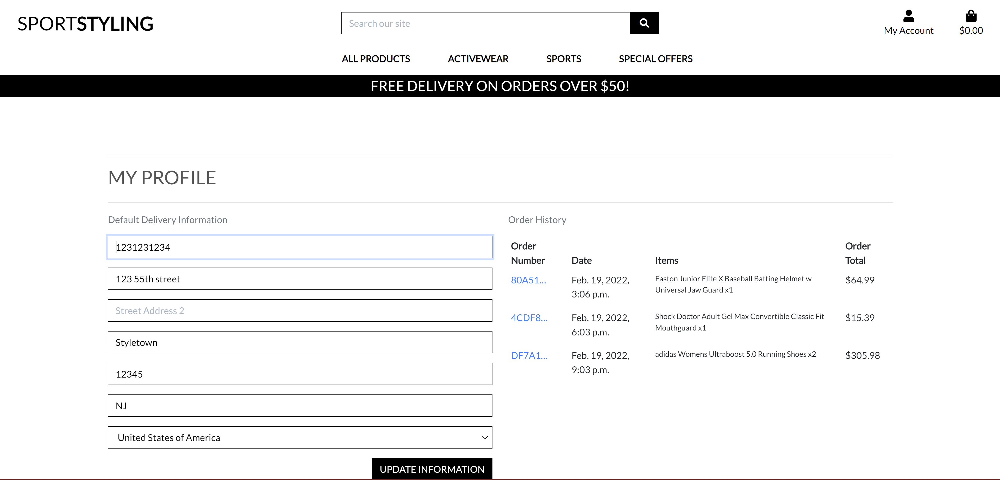.
- Returning using can also see there history when they come back to the site.
- For the admin the product can be added manually and delete. If they need to change the price and anyother details they can update it also.
- This is done by filling out a form. 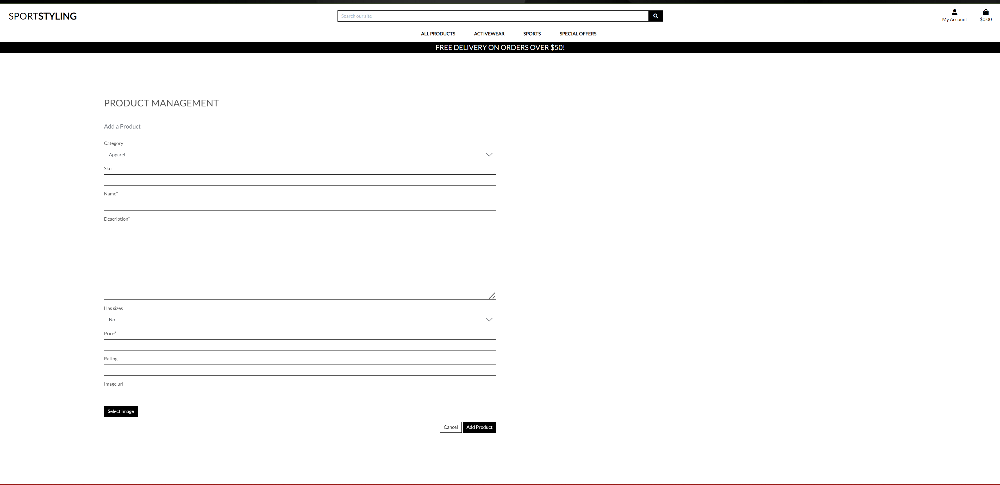.

### Frequent User Goals

- As a frequent user I would to stay signed in to my account so I dont have to signin everytime.
- As a frequent user, I would like to be able to search for any specific product on the website.
- In the Home page, there is a search function which allows users to find their desired products available by typing in the name of the products.
- If the product is available, the search result will display the service and if the product is unavailable, the search result will be blank space.
- Once the search result is displaying the available product users will be able to display the details of products by clicking the product image, the description will appear and will the customer the ability to purchase the item.
- If by any chance the user feels the product he added to the bag is not right then they can simply go to the cart and remove the products.
- If they edit the quantity or the size they just click on update. And along with that the cart will also be updated.
- If the user reaches $50 or the free shipping will be added automatically. 
- The returning user can see the profile check the past purchase history.
- The returning user can edit his address email and other information once they login.

### Return User Goals

- As a frequent user I would to stay signed in to my account so I dont have to signin everytime.
- As a frequent user, I would like to be able to search for any specific product on the website.
- In the Home page, there is a search function which allows users to find their desired products available by typing in the name of the products.
- If the product is available, the search result will display the service and if the product is unavailable, the search result will be blank space.
- Once the search result is displaying the available product users will be able to display the details of products by clicking the product image, the description will appear and will the customer the ability to purchase the item.
- If by any chance the user feels the product he added to the bag is not right then they can simply go to the cart and remove the products.
- If they edit the quantity or the size they just click on update. And along with that the cart will also be updated.
- If the user reaches $50 or the free shipping will be added automatically. 
- The returning user can see the profile check the past purchase history.
- The returning user can edit his address email and other information once they login.

## Responsiveness
This project was required to be totally responsive, and mobile friendly therefore I decided to use Bootstrap as my main framework for it's cut down components that result in a clean, uncluttered view and minimize to add custom styles. Testing was done using dev-tool during build process, and also a final test of the entire website was done using Android phone to check its responsives.
- Page was responsive overall and no major issue noticed however here was slightly issue with excess whitespace above and below footer while viewing on Android phone and specially search bar and the rest and search button would position themselves into coloums

### Navbar 
- There is My Account Icon and Shopping bag on the right corner.
- There is a search bar which can search the categories and products. If the names products are not there then an empty result will appear.
- Under the search bar there are navlinks which are All Products, Activewear, Sports and Special offers.
- These links are drop down so if the user clicks on All Products
   * By price 
   * By Rating
   * By Category
   * Shop all Products
- Under the Activewear 
   * Apparels
   * Accessories
   * Footwear
   * All Activewear
- Under the Sports
   * Baseball
   * Basketball
   * Football
   * Soccer
- Under Special Offers
   * New Arrivals
   * Deals
   * clearance
   * All Special Offers
- By using these links you can navigate to any products of your interest.
- On the main-image there is a shop now button which will redirect to the products page.
- On this page under my account you can register as new user or log in as a returning user.
- For registration there is simple form and login there is text field to enter the info and signin.

### Search field
- The search bar appears on top of the page. The search will look for words which are in the category name and the descriprtion product name. If the item is found will display in the  products.
- There is refine search based on categories.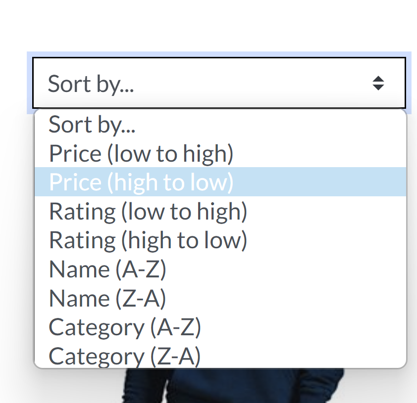

### Shopping Bag
- Once you have selected which items you like, just add them to the bag. 
- Once your ready to check out click on the bag and the added items will appear. 
- Now if you have second thoughts then simply remove or edit the items there and procede to checkout.
- In the shopping bag a message pops up stating how many items are in the cart and if you get free shipping of not.
- In the shopping bag till you dont reach 50 dollars there is a message appearing which shows how much more you need to spend to recieve free shipping.
- Under the bag constant total amount is display without you even clicking on the bag.

### Registration 
- Registration a simple form which contains an user name and password to register using allauths. The password and user name are properly validated using allauths.
- Fill out your username, email and password and just signup.
- Then a confirmation email will be sent to you and just have to confirm that your the user.
- Once thats done you can now simply login and continue shopping.

### Login
- After login in you'll see your profile in there.
- On clicking on that the new page will display your personal information which you have added and the past purchase history.
- You are allowed to edit your personal information and update them as you need it.

### Profile
- After login in you'll see your profile in there.
- On clicking on that the new page will display your personal information which you have added and the past purchase history.
- You are allowed to edit your personal information and update them as you need it.

### Product Management
- This section can only be used by the super user as an admin. 
- This page consists a form and that can be filled out by the admin for adding the products.
- Once the product is added the admin is the person who is able to delete and edit the products.
- The admin can change the price if there is a sale or for any reason.
- The admin doesnt have to remove the product from the product management he can remove from the products page.
 
### edit and delete
- When the admin edits the product the old description appears and can be easily updated.
- Once the edit is finished the updated product is display back to the product page with the changes made.
- The admin can completely delete the product from the shop.

### Logout
- Even after login out the user can still browse through the site without logging backin.

## Issues and Debugging
- The images and the text across all the pages had issues with the margin-top 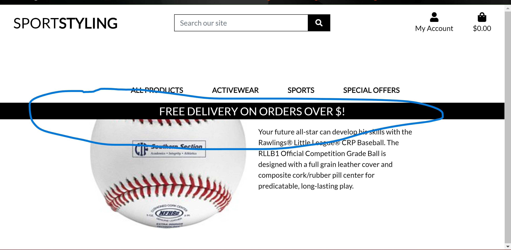
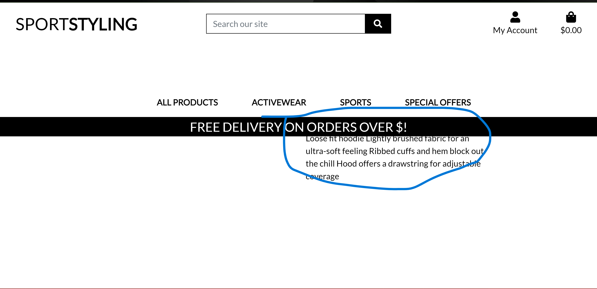.
- This was fixed by changing the bootstrap md-3 to my-5. 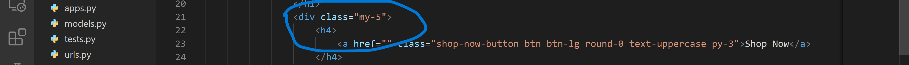.
- Bug with the image not generating from the database. 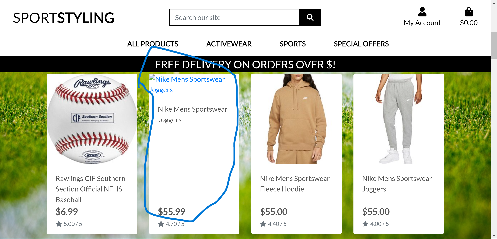, it was fixed by corrected by jpg which was not added.
- There was an issue with the CRSF 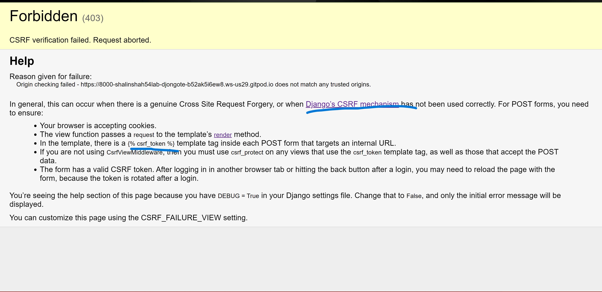 which was fixed by adding ``.
- Bug with the payment issue 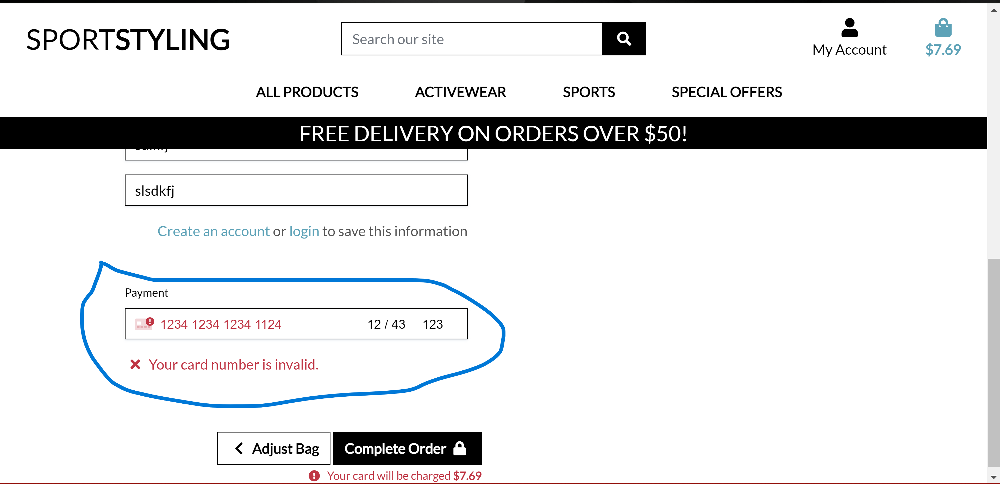
which was found that stripe uses credit card no.4242 4242 4242 4242 in the testing version.
- Seeing the products page where the logo-font there is alot of whitespace this was fixed by changing the css my-5 : 3rems, For now the margin is working fine.
- Found the Issue by the Assesser where my delpoyed site  presented with Server Error (500).
- This Issue by partially resolved with the help of the tutor. I had to remove the extra block content form the index.html file. And by removing the 

